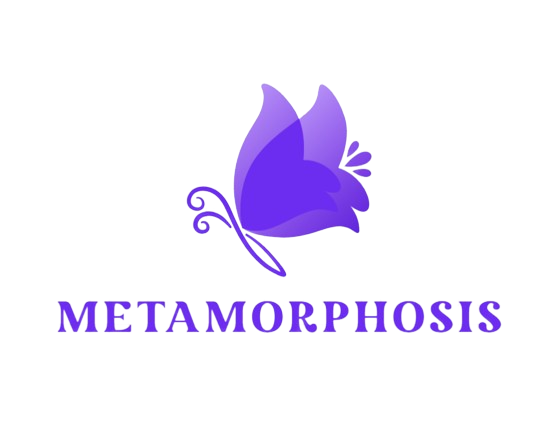

# Metamorphosis

Metamorphosis is an irregular, combining modern technologies to create a unique database capable of utilizing both SQL and vector search.

- The database supports very light and fast indexes using bitmap indexing.
- The .meta file supports deflate compression, allowing data to be stored very compactly and quickly.
- Internally, it supports the hnsw algorithm, enabling fast vector searches even in large datasets.
- Additionally, MetaNet supports the Vamana QT (Quantizer), developed as a disk-based Approximate Nearest Neighbor (ANN) for on-device use. This operates efficiently and advantageously in environments where excessive memory consumption in large datasets is an issue, performing well under constrained conditions similar to HNSW.
- This solution is designed to operate on small devices such as on-device and IoT environments. Therefore, if you are looking for a large-scale, high-availability system, it is recommended to consider well-recognized and excellent solutions like Milvus, Qdrant, and Weaviate.

It is currently under active development, with pgvector as a competing product.

### All documentation and descriptions will be written once the development has reached a certain stage of production readiness.
