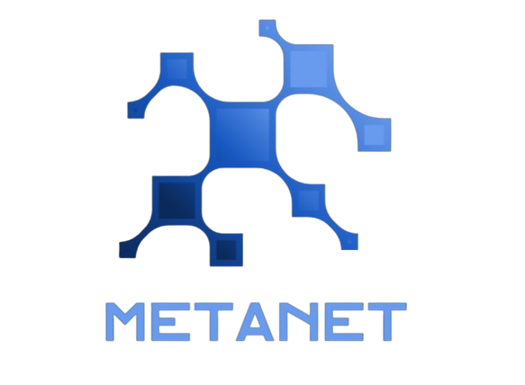

# MetaNet

MetaNet utilizes VamanaQT, which is a quantized version of the VamanaIndex developed by Kuentra. We have newly developed this based on DiskANN to address the issue of excessive memory allocation that occurs in environments with limited resources like on-device systems, or when datasets expand excessively, or when using advanced high-dimensional embeddings (such as OpenAI's embeddings, which range from 1536 to over 3000 dimensions).
